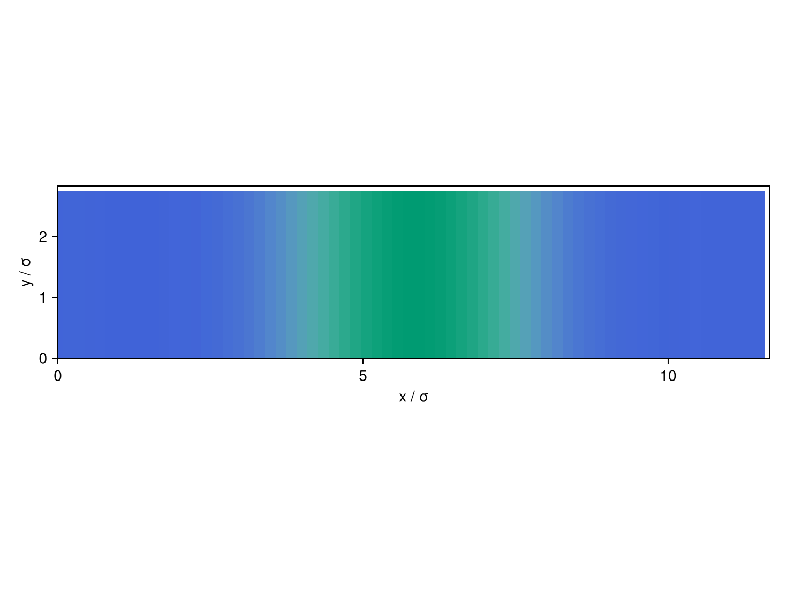
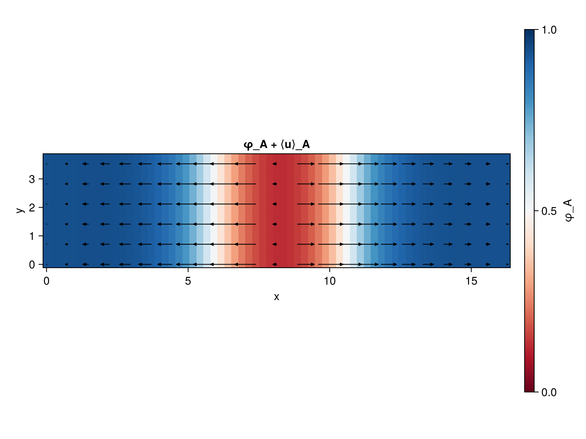
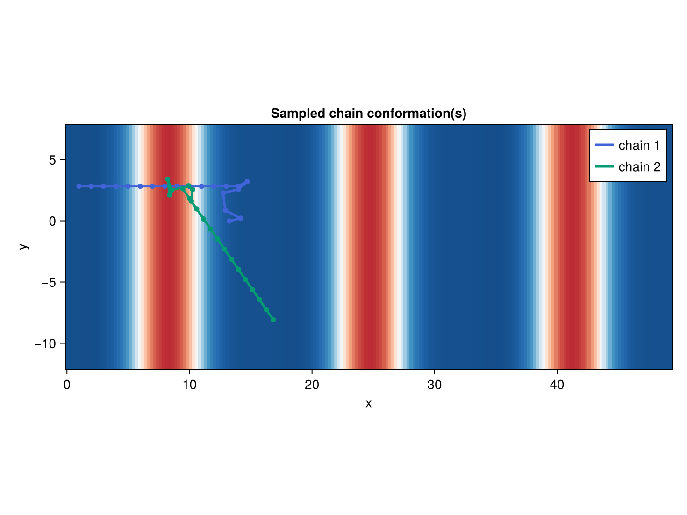

# Worm-Like Chains & Orientational Order

The [Self-Consistent Field Theory tutorial](../tutorials/scft.md) builds an `SCFTSystem`
around `SCFTLatticeFluid`, whose `DiscreteGaussianChainPropagator` has no notion of bond
orientation at all — only position. `SCFTWormLikeChainFluid` (see [Worm-Like Chain
Model](../models/scft.md#Worm-Like-Chain-Model)) instead tracks each species' full 3D
bond orientation alongside position, via `WLCPropagator`. This tutorial builds a
rod-coil diblock melt (one exactly rigid species, one flexible) and shows the three
things that unlocks beyond a density profile: a nematic order parameter, a mean
orientation vector field, and actual sampled single-chain conformations.

The parameters below (`χN=16`, `f=0.7`, and a conformational-asymmetry parameter
`ν⁻²=10`) match the lamellar point of Fig. 11 in Tang et al., *Macromolecules* **48**,
9060 (2015) — a convenient, literature-anchored starting point, not a requirement of the
model itself.

## Building the worm-like-chain model

`SCFTWormLikeChainFluid` takes the same `(name, sequence)` component list as
`SCFTLatticeFluid`, but `b` (bond length) and `lp` (persistence length) are both
indexed by species, instead of a single shared statistical segment length. Species
`"A"` (the rod) is set to the exact rigid-rod limit, `lp=Inf`; species `"B"` (the coil)
gets a finite persistence length:

```julia
julia> using ClassicalDFT

julia> N_A, N_B = 14, 6

julia> f = N_A / (N_A + N_B)   # 0.7 -- rod is the majority species

julia> b = [1.0, sqrt(2)]      # bond length per species

julia> lp = [Inf, 0.5*sqrt(2)] # persistence length per species -- A: exact rigid rod

julia> chi = zeros(2, 2)

julia> chi[1, 2] = chi[2, 1] = 0.8

julia> model = SCFTWormLikeChainFluid([("diblock", ["A"=>N_A, "B"=>N_B])], b, lp, chi;
                                       rho0=1.0, kappa=25.0, L_max=6)
```

`L_max` is the spherical-harmonic truncation degree used to resolve each bond's
orientation distribution (see `SCFTWormLikeChainFluid`'s own docstring for how to pick
it) — larger for stiffer species, at the cost of more orientation-grid nodes per SCFT
iteration.

As in every other tutorial, chain connectivity is supplied separately via
`mol_structure`:

```julia
julia> mol_structure = Dict("diblock" => custom_structure("A"^N_A * "B"^N_B))
```

## Seeding and converging

This example uses a 2D structure (`LamellarStack2DCart`) rather than 1D, purely so the
chain-conformation plots later in this tutorial have a second axis to show orientation
in — the physics itself is uniform along `y`. `core_fraction=f` seeds the core (rod)
layer at its own composition fraction rather than assuming an even 50/50 split, which
matters here since the two species have very different lengths:

```julia
julia> Lx, Ly = 16.5, 4.0   # Lx: the equilibrium period for this system, found separately
                            # by minimizing free energy over a range of L -- not repeated here

julia> ngrid = (67, 17)

julia> structure = LamellarStack2DCart((0.0, 0.0), [1.0], [0.0 Lx; 0.0 Ly], ngrid;
                                        core_groups=["A"], core_fraction=f)

julia> n_chains = (Lx * Ly) / (N_A + N_B)

julia> system = SCFTSystem(model, structure, DFTOptions();
                            mol_structure=mol_structure,
                            ensemble=[:canonical],
                            n_molecules=[n_chains])
```

An exactly rigid species pushes the Anderson-accelerated solver's default step size past
its stability limit for this system — pass a smaller `beta` explicitly:

```julia
julia> ρ = initialize_profiles(system)

julia> converge!(system, ρ; tol=1e-5, maxit=3000, beta=5e-3)
```

```
SCFT converged after 920 iterations: err = 6.27e-5 | F = 10.2428
```

```julia
julia> plot(system, ρ)
```



## Orientation order and the mean orientation field

Position isn't the only thing resolved in space anymore. `orientation_order_parameter`
gives the local nematic order `S_α(x) = (3⟨u_x²⟩_α(x)-1)/2` (`S=1`: fully aligned with
the domain normal; `S=-1/2`: fully perpendicular) — but computing it needs `q_in`/`q_out`
resolved in orientation, one more `propagate!` call at the converged field (the same
extra step `compute_densities!` takes internally to build `ρ` from a marginalized
version of the same quantity):

```julia
julia> w = zeros(size(ρ)...);

julia> w_bulk = ClassicalDFT.compute_bulk_fields(system.model, ClassicalDFT.compute_bulk_densities(system));

julia> ClassicalDFT.compute_fields!(system, ρ, w);

julia> cache_propagator = ClassicalDFT.preallocate_propagator(system, system.propagator, ρ, CPU());

julia> ClassicalDFT.propagate!(system, ρ, w, cache_propagator; w_bulk=w_bulk);

julia> q_in = ClassicalDFT.cache_q_in(cache_propagator);

julia> q_out = ClassicalDFT.cache_q_out(cache_propagator);

julia> S = orientation_order_parameter(system, q_in, q_out; axis=1);
```

`S` is nonzero even for a perfectly head-tail-symmetric alignment (`u` and `-u` equally
likely) — it only measures *nematic* order. `mean_orientation_field` instead gives the
true polar vector `⟨u⟩(r)`, which is only nonzero when there's a genuine directional
bias — here, because each rod is covalently bonded to a coil at one specific end:

```julia
julia> mean_u = mean_orientation_field(system, q_in, q_out);

julia> plot_orientation_field(system, ρ, q_in, q_out; species=1)
```



The arrows flip direction right at the coil domain's own center and again at the
periodic boundary — a real, reproducible sign structure, not noise (see the
[`mean_orientation_field`](../api/methods.md#Orientation-(WLC-only)) docstring for why
this can be a much smaller vector than the nematic order `S` alone would suggest, and
[Chain Conformation Sampling](../api/methods.md#Chain-Conformation-Sampling-(WLC-only))
for what's driving it).

`plot_orientation_field` needs a Makie backend loaded (e.g. `using CairoMakie`) — it's a
stub in the main package otherwise, following the same pattern as `Makie.plot(system,
ρ)` itself.

## Sampling single-chain conformations

Every quantity above — `ρ`, `S`, `⟨u⟩` — is an ensemble-averaged marginal.
`terminal_orientation_anchor` finds a terminal bead's own most-likely position (and
either its most-likely or mean orientation there), and `sample_chain` reconstructs one
full, concrete bead-by-bead realization consistent with the converged field, walking
away from that anchor:

```julia
julia> using Random

julia> r0, u0, mean_u_1 = terminal_orientation_anchor(system, q_in, q_out, 1; orientation=:mean);

julia> R1 = sample_chain(system, q_in, q_out, 1, r0, u0; rng=MersenneTwister(1));

julia> r0N, u0N, mean_u_N = terminal_orientation_anchor(system, q_in, q_out, N_A + N_B; orientation=:mean);

julia> R2 = sample_chain(system, q_in, q_out, N_A + N_B, r0N, u0N; rng=MersenneTwister(2));

julia> plot_chain_conformations(system, ρ, [R1, R2])
```



Bead `1` is the rod's free end, bead `N_A+N_B` the coil's — each anchored independently
at its own most-likely position. Every rod-rod bond is exactly rigid (`lp=Inf`), so the
rod segment of each sampled chain is a perfectly straight line; only the flexible coil
bonds (and the rod-coil junction) are genuinely random per call. Since a sampled
conformation can legitimately wander outside the structure's own periodic box (unlike a
density profile, which never needs to), `plot_chain_conformations` tiles the background
to whatever extent the chains actually reach, rather than clipping them.

## Next steps

- `nu` (see `SCFTWormLikeChainFluid`'s docstring) adds an explicit Maier-Saupe
  orientational coupling between species, on top of the immiscibility-driven alignment
  shown here.
- `orientation_order_parameter`/`mean_orientation_field`/`sample_chain` all work
  identically for `dimension(system) ∈ {1,2,3}` (only `plot_chain_conformations` itself
  is currently 2D-only) — see [Methods](../api/methods.md) for the full list.
- [Block-Copolymer Microphase Morphologies](@ref) covers every other `LamellarStack*`/
  `HexLattice*`/`BCC3DCart`/`Gyroid3DCart` seed, all of which work as `SCFTSystem`
  structures the same way.
